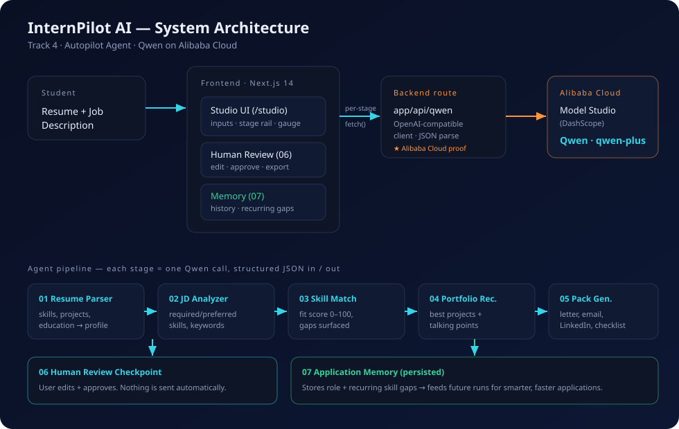

# Architecture

InternPilot AI is a **chained multi-agent workflow**. The frontend orchestrates five reasoning
agents sequentially, then enforces a human checkpoint, then persists memory. Every reasoning
step is a single, isolated Qwen call with a strict JSON contract — which is what makes the
system modular, testable, and debuggable rather than a single fragile prompt.

## Request flow

1. **Student** pastes a resume + job description in the Studio (`/studio`).
2. The client orchestrator (`lib/pipeline.ts`) calls the backend once **per stage**, passing the
   accumulated context forward.
3. The **backend route** (`app/api/qwen/route.ts`) selects that stage's system prompt, calls
   **Qwen on Alibaba Cloud Model Studio** with `response_format: json_object`, and returns parsed JSON.
4. Results render progressively (stage rail, fit gauge, project picks, draft pack).
5. **Human Review (06):** outputs are fully editable; the user approves and exports a Markdown pack.
6. **Memory (07):** the run (role, score, missing skills) is persisted; recurring gaps feed future runs.

## Why this design scores

- **Modularity / scalability:** each agent is one prompt + one type; swap a model or add a stage
  without touching the others.
- **Error handling:** the backend recovers JSON from imperfect model output and degrades to clearly
  labelled demo data when no key is present, so the app never hard-fails for a reviewer.
- **Human-in-the-loop:** personal documents are never auto-submitted — a hard requirement for Track 4.
- **Statefulness:** cross-session memory turns repeated use into compounding value.
